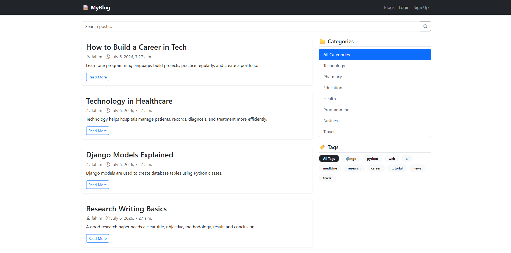
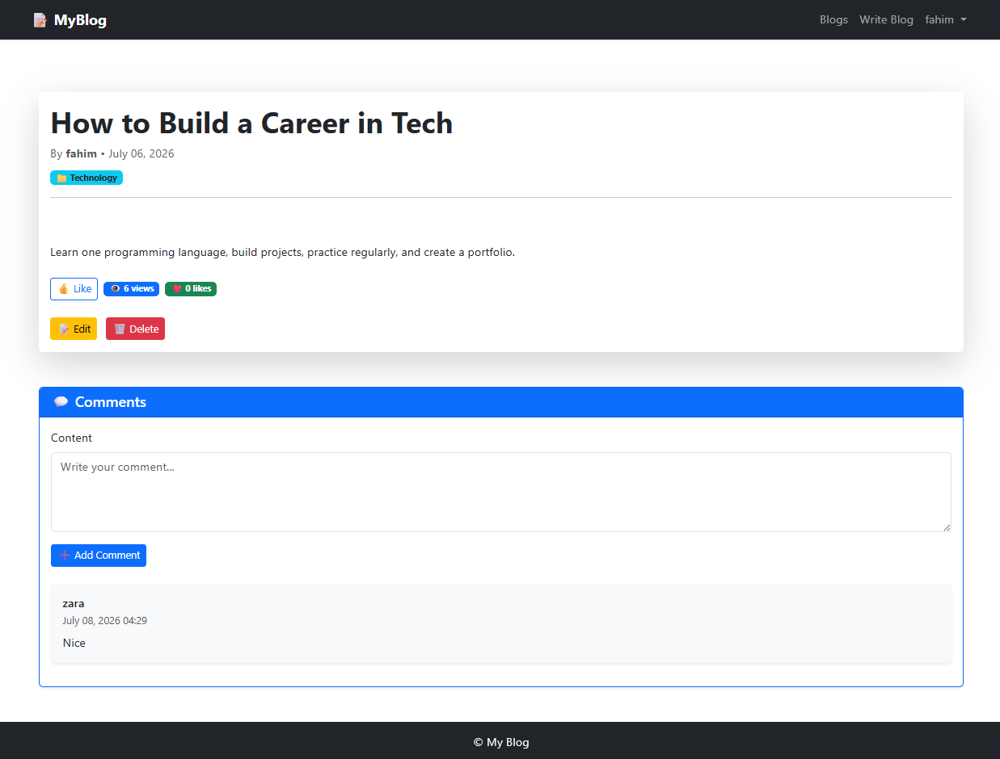
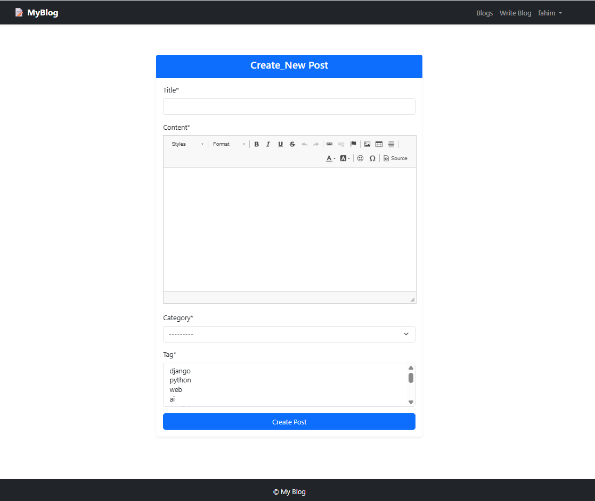
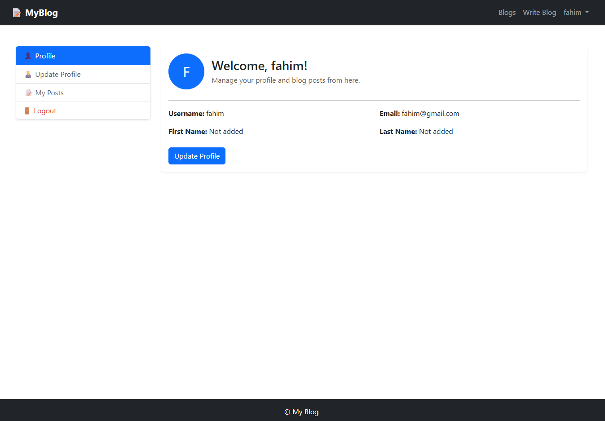
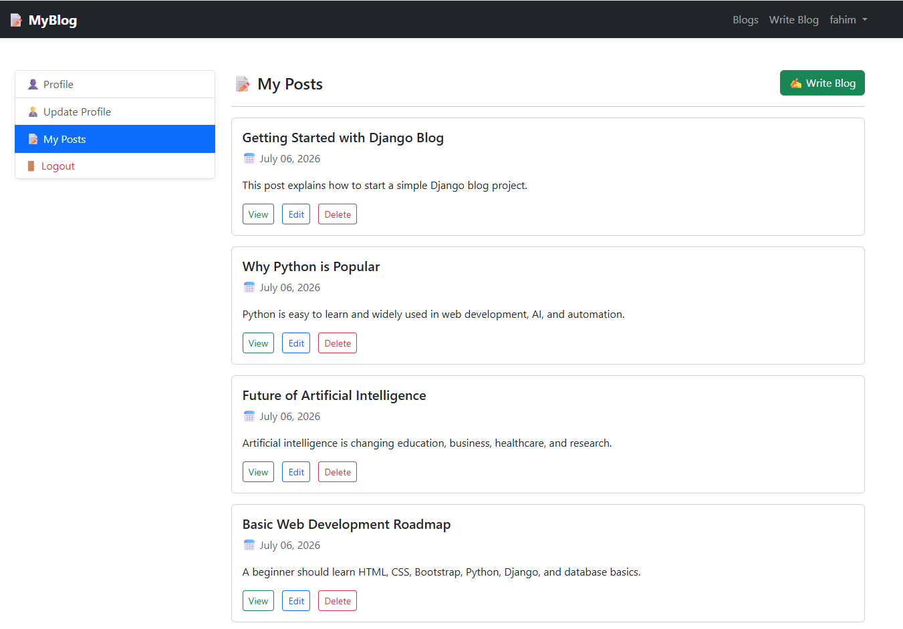

# Django Blog Application

A simple and responsive Blog Management web application built with Django.  
Users can create blog posts, read posts, search posts, filter posts by category and tag, like posts, comment on posts, and manage their own profile.

---

## Features

- User Registration and Login
- User Logout with redirect to blog list page
- Create Blog Post
- Read Blog Post Details
- Update Blog Post
- Delete Blog Post
- Rich Text Blog Content using CKEditor
- Category-based Blog Filtering
- Tag-based Blog Filtering
- Blog Search System
- Pagination for Blog Posts
- Like and Unlike Blog Posts
- Comment System
- User Profile Page
- Update User Profile
- My Posts Section for Logged-in Users
- Responsive Bootstrap 5 UI
- Automated Test Cases for Main Features

---

## Technologies Used

- Python
- Django
- SQLite3
- HTML5
- CSS3
- Bootstrap 5
- Bootstrap Icons
- Django Crispy Forms
- Crispy Bootstrap 5
- Django CKEditor

---

## Project Structure

```bash
myblog/
│
├── blog/
│   ├── migrations/
│   ├── admin.py
│   ├── apps.py
│   ├── forms.py
│   ├── models.py
│   ├── tests.py
│   ├── urls.py
│   └── views.py
│
├── myblog/
│   ├── settings.py
│   ├── urls.py
│   ├── wsgi.py
│   └── asgi.py
│
├── templates/
│   ├── blog/
│   │   ├── base.html
│   │   ├── post_create.html
│   │   ├── post_details.html
│   │   └── post_list.html
│   │
│   └── user/
│       ├── login.html
│       ├── profile.html
│       ├── signup.html
│       └── update_profile_form.html
│
├── screenshots/
│   ├── home_page.png
│   ├── post_details.png
│   ├── create_post.png
│   ├── profile_page.png
│   └── my_posts.png
│
├── manage.py
├── requirements.txt
├── README.md
└── .gitignore
```

---

## Main Models

The project contains four main models:

### Category

Used to group blog posts under different categories.

### Tag

Used to filter and identify posts by specific topics.

### Post

Stores blog title, rich text content, author, category, tags, views, and liked users.

### Comment

Stores user comments under each blog post.

---

## Installation

Clone the repository:

```bash
git clone https://github.com/your-username/django-blog-app.git
cd django-blog-app
```

Create virtual environment:

```bash
python -m venv .venv
```

Activate virtual environment:

### Windows

```bash
.venv\Scripts\activate
```

### Linux / macOS

```bash
source .venv/bin/activate
```

Install dependencies:

```bash
pip install -r requirements.txt
```

Run migrations:

```bash
python manage.py makemigrations
python manage.py migrate
```

Create superuser:

```bash
python manage.py createsuperuser
```

Start development server:

```bash
python manage.py runserver
```

Open the project in browser:

```bash
http://127.0.0.1:8000/
```

---

## URL Routes

| Page | URL | URL Name |
|---|---|---|
| Blog List | `/` | `post_list` |
| Post Details | `/post/<id>` | `post_details` |
| Like Post | `/post/<id>/like` | `like_post` |
| Create Post | `/post/create` | `post_create` |
| Update Post | `/post/update/<id>` | `post_update` |
| Delete Post | `/post/delete/<id>` | `post_delete` |
| Signup | `/singup/` | `singup` |
| Profile | `/profile/` | `profile_view` |
| Login | `/login/` | `login` |
| Logout | `/logout/` | `logout` |

---

## Screenshots

Create a folder named `screenshots` in the root directory and add your screenshots using the following names.

### Home / Blog List Page



### Post Details Page



### Create Blog Post



### User Profile Page



### My Posts Section



---

## Running Tests

This project includes automated tests for:

- Blog list page
- Post details page
- Category filter
- Tag filter
- Search system
- Login page
- Signup page
- User signup
- Profile page
- My posts section
- Post creation
- Comment creation
- Like system
- Logout system

Run all tests:

```bash
python manage.py test
```

Run only blog app tests:

```bash
python manage.py test blog
```

Expected output:

```bash
Ran 14 tests

OK
```

---

## Important Notes

- The project uses SQLite3 as the default database.
- The `db.sqlite3` file should not be pushed to GitHub.
- The virtual environment folder should not be pushed to GitHub.
- CKEditor is used for rich text blog content.
- Crispy Forms with Bootstrap 5 is used for better form design.
- Login redirects users to the blog list page.
- Logout also redirects users to the blog list page.

---

## .gitignore

Use this `.gitignore` in the root directory:

```gitignore
# Python
__pycache__/
*.py[cod]
*.pyo
*.pyd

# Virtual Environment
.venv/
venv/
env/

# Django Database
db.sqlite3
*.sqlite3
*.sqlite3-journal

# Static and Media Files
staticfiles/
media/

# Environment Variables
.env
*.env

# VS Code
.vscode/

# Logs
*.log
```

---

## Author

Developed by Md Fahim Shahriar

---

## License

This project is created for learning and academic practice purposes.
